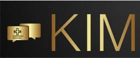
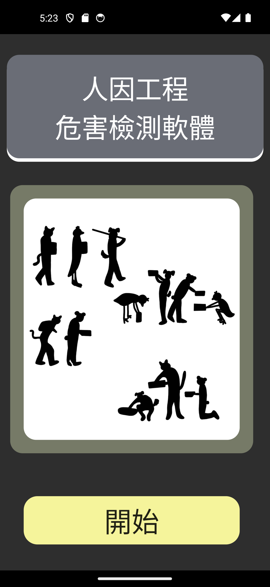
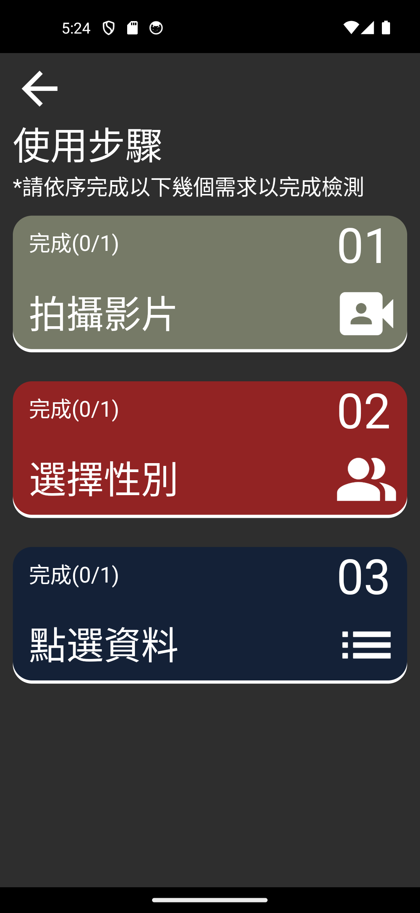
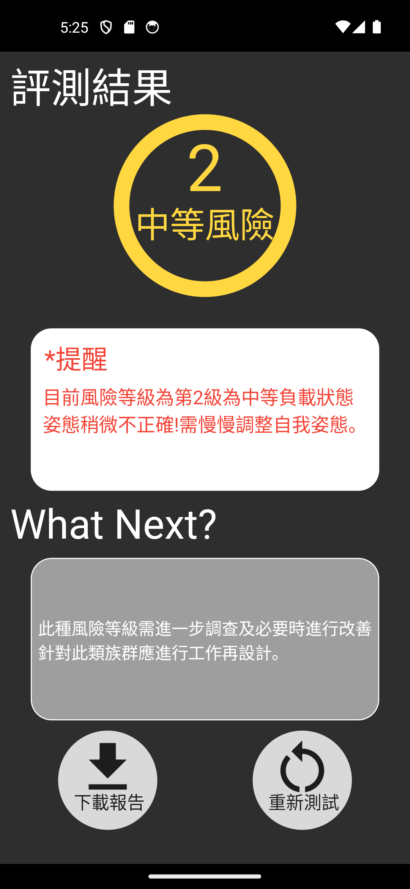
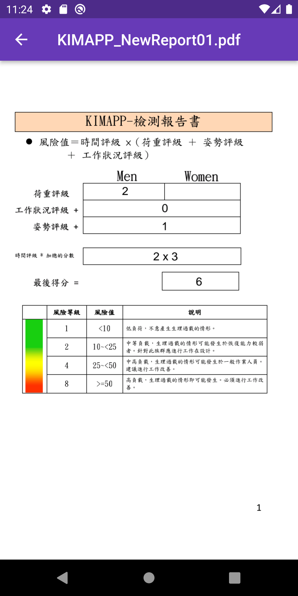

# KimApp - AI姿態辨識系統

<p align="center">
  
</p>

<p align="center">
  <strong>🏆 2022永續智慧創新黑客松 亞軍 | 2023畢業專題學院獎</strong>
</p>

---

## 專案簡介

職場肌肉骨骼傷病（WMSD）是台灣勞工最常見的職業傷害之一。**KimApp** 是一款基於AI姿態辨識技術的職業安全評估工具，幫助企業快速辨識員工作業姿勢的風險，預防肌肉骨骼傷病的發生。

### 解決的問題
- ✅ 傳統人工評估耗時且主觀
- ✅ 員工搬運姿勢不當導致職業傷害
- ✅ 企業缺乏即時的危害辨識工具

### 提供的解決方案
- 📱 手機即時姿態檢測
- 🤖 AI自動辨識危險動作
- 📊 即時風險評估與改善建議
- 📄 自動生成PDF風險評估報告

---

## 功能展示

<table>
  <tr>
    <td align="center">
      <br>
      <b>主頁</b>
    </td>
    <td align="center">
      <br>
      <b>姿態檢測</b>
    </td>
    <td align="center">
      <br>
      <b>風險評估結果</b>
    </td>
    <td align="center">
      <br>
      <b>PDF報告書</b>
    </td>
  </tr>
</table>

---

## 我的貢獻

作為APP開發負責人，我在這個專案中負責：

- 📱 **Flutter APP完整開發** - 從零建構雙平台應用
- 🎨 **UI/UX設計與實作** - 設計直覺易用的使用者介面
- 🔗 **AI模型整合** - 將TFLite模型整合至APP端
- 📸 **相機功能開發** - 實作即時影像擷取與處理
- 📄 **PDF報告生成** - 開發自動化風險評估報告功能
- 👥 **團隊協作與專案管理** - 協調APP與AI團隊的合作

> **註**: AI姿態辨識模型由團隊其他成員開發，我負責將模型整合至APP並實作完整的使用者體驗。

---

## 技術棧

### 開發環境
- **Flutter**: 3.13.0
- **Dart**: 3.0.5

### 核心技術
- **TFLite** - AI模型推論
- **Camera Plugin** - 即時影像擷取
- **PDF Generation** - 報告書生成
- **Provider** - 狀態管理

### 參考標準
- **KIM-LHC量表** - 人因工程風險評估標準

---

## 快速開始

### 環境需求
- Flutter SDK 3.13.0 或以上
- Dart 3.0.5 或以上
- Android/iOS 實體裝置或模擬器

### 安裝步驟

1. **Clone專案**
```bash
git clone https://github.com/jackey134/KimApp.git
cd KimApp
```

2. **安裝依賴**
```bash
flutter pub get
```

3. **檢查裝置連接**
```bash
flutter devices
```

4. **運行APP**
```bash
flutter run
```

---

## 獲獎紀錄

### 🏆 2022永續智慧創新黑客松 - 亞軍
- 主辦單位：靜宜大學
- 參賽主題：智慧安全與健康
- 獲獎原因：創新運用AI技術解決職業安全問題

### 🏆 2023畢業專題學院獎
- 頒發單位：靜宜大學資訊學院
- 評選標準：技術創新性、實用性、完整度

---

## 專案背景

根據勞動部統計，肌肉骨骼傷病是台灣職場最常見的職業傷害。傳統的人工評估方式不僅耗時，且容易受到評估者主觀因素影響。

**KimApp** 運用AI技術，讓職業安全評估變得：
- **更快速** - 即時完成風險評估
- **更客觀** - AI標準化判斷
- **更便利** - 手機即可使用

---

## 疑難排解

如遇到安裝或執行問題，請參考：
[問題處理文件](https://docs.google.com/document/d/1KW22qHDZnxiGPb0G6VZbO-Jrt2KE338L/edit?usp=sharing&ouid=115278390232488920752&rtpof=true&sd=true)

---

## 專案資訊

- **開發時間**: 2023.07 - 2024.12
- **團隊人數**: 5人（2位APP開發、3位AI開發）
- **我的角色**: APP開發負責人
- **開發平台**: Android、iOS

---

## 授權聲明

本專案為靜宜大學畢業專題作品，僅供學習與展示用途。

---

## 聯絡方式

如有任何問題或建議，歡迎聯繫：
- **GitHub**: [@jackey134](https://github.com/jackey134)
- **Email**: liu8825515@gmail.com
